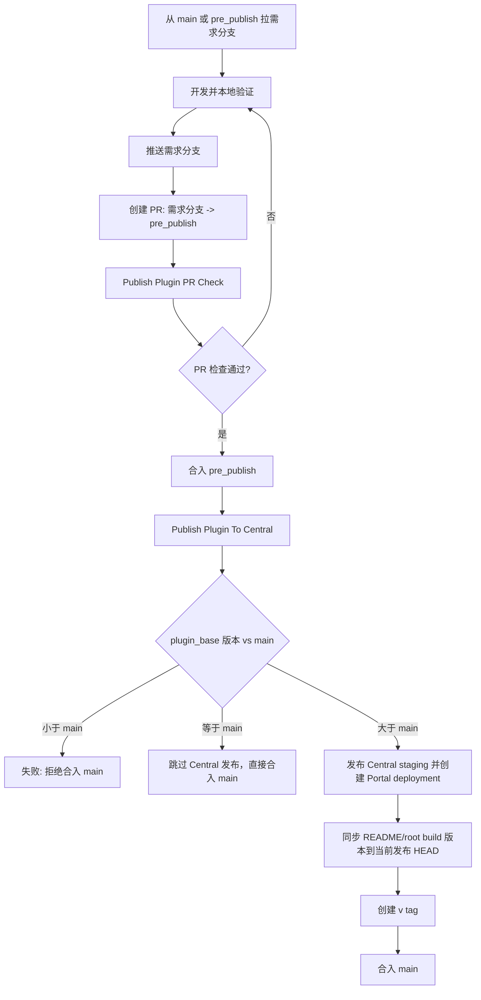

# PublishPlugin 分支与发布工作流

本文整理本仓库从需求分支创建到合入 `main` 的完整流程。当前远端主分支是 `main`，不是 `master`。

## 分支职责

| 分支 | 职责 | 写入方式 |
| --- | --- | --- |
| `main` | 稳定主线；发布成功或无需发布的变更最终进入这里。 | 由发布 workflow 或维护者合并。 |
| `pre_publish` | 预发布集成分支；所有需求分支先合入这里。 | 通过 PR 合入，触发发布 workflow。 |
| 需求分支 | 单个需求、修复或实验的开发分支。 | 开发者或 agent 推送，向 `pre_publish` 提 PR。 |

推荐需求分支命名：

```text
feature/<short-name>
fix/<short-name>
codex/<short-name>
```

## 总体流程



## 1. 创建需求分支

普通需求从当前稳定主线或最新预发布分支切出。选择规则：

- 只改文档、workflow、demo、skill 或非发布插件核心逻辑：通常从 `main` 切出即可。
- 改 `plugin_base/` 或依赖最近未发布改动：从最新 `pre_publish` 切出，减少后续冲突。

示例：

```bash
git fetch enter main pre_publish
git switch -c feature/demo-publish enter/main
```

开发过程中不要直接提交到 `main` 或 `pre_publish`。

## 2. 同步目标分支

提交 `需求分支 -> pre_publish` 的 PR 前，需求分支应该先同步最新 `pre_publish`。不要 rebase、reset 或改写共享的远端 `pre_publish` 分支。

推荐做法：

```bash
git fetch enter main pre_publish
git switch feature/demo-publish
git rebase enter/pre_publish
```

如果 `main` 比 `pre_publish` 更新，或者发布 workflow 曾提示 `pre_publish cannot be preflight-merged into main`，说明后续 `pre_publish -> main` 可能冲突。此时应在需求分支上把 `main` 合进来并解决冲突：

```bash
git fetch enter main pre_publish
git switch feature/demo-publish
git rebase enter/pre_publish
git merge enter/main
# 解决冲突并完成验证后，更新需求分支
git push --force-with-lease
```

边界规则：

- 可以 rebase 需求分支到 `enter/pre_publish`。
- 可以在需求分支上 merge `enter/main`，提前解决最终合主冲突。
- 不要 rebase 远端 `pre_publish` 到 `main`。
- 不要 reset 远端 `pre_publish` 到 `main`。
- `pre_publish -> main` 的最终合入由发布 workflow 自动完成。

## 3. 本地验证

按改动范围选择验证命令：

```bash
# workflow / 发布脚本相关
for test in .github/scripts/*_test.py; do python3 "$test"; done

# 插件核心逻辑相关
./gradlew :plugin_base:build --stacktrace
./gradlew :plugin_base:publishToMavenLocal --stacktrace
python3 .github/scripts/validate_publish_plugin_publications.py
python3 .github/scripts/sync_readme_publish_version.py --check

# skill 文件相关
./scripts/install-codex-skill.sh --check
```

如果改了 `skills/publishplugin-one-click-publish/**`，仓库内 skill 目录是源文件，运行时 skill 必须继续通过 `scripts/install-codex-skill.sh` 指向仓库目录。

## 4. 提 PR 到 pre_publish

需求分支推送后，创建 PR：

```text
需求分支 -> pre_publish
```

不要直接 PR 到 `main`，否则会绕过本仓库的预发布和 Central 发布编排。

PR 打开、更新或重新打开时，会运行 `.github/workflows/publish-plugin-pr-check.yml` 的 `validate` job。

## 5. PR 校验逻辑

PR 校验只负责发布前验证，不发布 Central。

校验内容：

1. 读取 PR base 分支上的 `plugin_base` 版本。
2. 检测 PR 相对 base 是否修改了 `plugin_base/`。
3. 如果没有修改 `plugin_base/`，跳过自动版本检查、README 版本同步和 bot 提交。
4. 如果修改了 `plugin_base/`：
   - 规范化版本为 `数字.数字.数字`。
   - 确认版本大于 base 分支版本。
   - 必要时自动 patch +1。
   - 同步 README 中的插件使用版本。
   - 同仓库 PR 可以由 `github-actions[bot]` 自动提交版本修正；fork PR 需要人工修正。
5. 运行发布辅助脚本测试。
6. 运行 `:plugin_base:build`、`publishToMavenLocal`、publication 校验和 README 版本一致性检查。

只有 PR 校验通过后，需求分支才能合入 `pre_publish`。

## 6. 合入 pre_publish 后的发布判断

PR 合入 `pre_publish` 后，`.github/workflows/publish-plugin-central.yml` 会自动运行。

它先比较：

```text
pre_publish 的 plugin_base 版本
main 的 plugin_base 版本
```

结果分三类：

| 版本关系 | 行为 |
| --- | --- |
| `pre_publish < main` | 失败，拒绝合入 `main`。 |
| `pre_publish == main` | 说明没有插件发布需求，跳过 Central 发布和 tag，直接合入 `main`。 |
| `pre_publish > main` | 进入正式发布流程。 |

正式发布前会先预演当前发布 HEAD 合入 `origin/main`。如果存在冲突，workflow 失败，不发布 Central，也不合入 `main`。

## 7. 正式发布流程

当 `pre_publish` 版本大于 `main` 时，发布 workflow 执行：

1. 确认 `v<version>` tag 不存在，或已存在且正好指向当前提交。
2. 确认 PGP public key 可用。
3. 设置 JDK 和 Gradle。
4. 执行本地 publication metadata 校验。
5. 发布到 Central staging repository。
6. 调用 Central manual upload endpoint 创建 Central Portal deployment。
7. 同步 README 和根 `build.gradle.kts` 中的发布插件版本。
8. 如果同步产生改动，在当前发布 HEAD 上提交 `[codex] Update publish plugin usage version to <version> [skip ci]`。
9. 创建并推送 `v<version>` tag。
10. 将当前发布 HEAD 合入 `main` 并推送 `main`。

注意：发布后版本同步提交不会再直接推回 `pre_publish`。这样可以避免受保护的 `pre_publish` 因缺少 required check 而拒绝 bot push。

如果 Central 发布失败，则不会同步 README/root build，不会创建 tag，也不会合入 `main`。

## 8. 无需发布的合入流程

如果 `pre_publish` 与 `main` 的 `plugin_base` 版本相同，workflow 认为本次变更不需要发布新的插件版本。

这类变更包括：

- 文档更新。
- workflow 修复。
- demo 更新。
- skill 或脚本更新但不改变 `plugin_base` 发布产物。

流程会跳过 Central 发布和 tag，直接把 `pre_publish` 合入 `main`。

## 9. 分支清理

需求完成后应清理一次性需求分支，避免远端长期堆积已完成分支。

清理规则：

- 删除：已合入 `pre_publish` 且不再继续开发的 `feature/*`、`fix/*`、`codex/*` 等一次性需求分支。
- 保留：`main`、`pre_publish`。
- 谨慎处理：`backup/*`、长期维护分支、多人共用分支；删除前需要维护者确认。

如果通过 GitHub PR 页面合并，优先使用页面上的 `Delete branch`。命令行示例：

```bash
# 删除远端需求分支
git push enter --delete feature/demo-publish

# 删除本地需求分支
git branch -d feature/demo-publish
```

如果需求分支后续还要继续承接修复，可以暂时保留；最终合入 `main` 后再清理也可以。

## 10. 手动合入远端 pre_publish 到 main

正常情况下应让 `publish-plugin-central.yml` 自动完成 `pre_publish -> main`。只有 workflow 被配置问题阻断、且已经确认无需重新发布或需要修复流程本身时，才手动操作。

手动操作前必须确认：

1. 当前远端主分支是 `main`。
2. 已经 `git fetch enter main pre_publish --tags`。
3. 本地工作区干净。
4. 明确是否需要额外 workflow 修复提交。
5. 不手动升级版本，除非本次需求就是发布插件新版本。

示例：

```bash
git fetch enter main pre_publish --tags
git switch main
git merge --no-ff enter/pre_publish
# 如需修复 workflow，单独提交修复
git push enter main
```

手动合入后，应确认：

```bash
git fetch enter main pre_publish
git status --short --branch
git log --oneline --decorate --max-count=5 enter/main
```

## 11. 常见失败处理

| 失败点 | 含义 | 处理方式 |
| --- | --- | --- |
| `Publish Plugin PR Check` 版本检查失败 | `plugin_base/` 有变更但版本没有高于 base。 | 按提示升级 `plugin_base` 版本并同步 README，或接受 bot 自动提交。 |
| `pre_publish version ... must not be lower than main version` | 预发布版本低于主线。 | 先同步主线或修正版本，重新走 PR。 |
| `pre_publish cannot be preflight-merged into main` | 发布前预演合并发现冲突。 | 把 `main` 合入需求分支或 `pre_publish`，解决冲突后重跑。 |
| Central upload/deployment 失败 | 发布到 Central 或创建 Portal deployment 失败。 | 查看 Actions 日志和 Central Portal，修复凭据、签名、POM 或 artifact 问题后重跑。 |
| protected branch 拒绝 bot push | workflow 试图直接推受保护分支。 | 不应再发生；保持发布后同步提交只存在于当前发布 HEAD，再合入 `main`。 |
